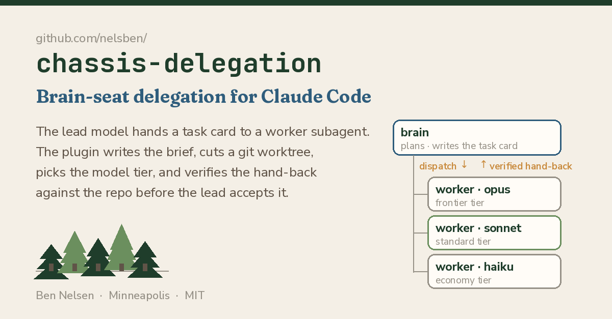

# chassis-delegation

Brain-seat delegation for Claude Code. The main model (the "brain") hands a
task card to a worker subagent with one tool call, `dispatch`. The mod does the
rest. It writes the brief, cuts a git worktree and picks the model tier. It
spawns the worker, holding it in a queue while two others run. When the worker
reports, the mod checks the report against the repo itself (branch, sha,
changed files, scope, gate, PR) and hands the brain one verdict line with what
to do next. At a quiet stop it can write a debrief in the background, and it
can run your eval when `origin/main` moves. It is a Claude Code mod (a plugin
of function hooks). It needs nothing from any other repo: no scripts, no
harness, no network. Version 0.5.0, MIT.

## Install on a new machine

1. **Clone** the mod (terminal):

       git clone https://github.com/nelsben/chassis-delegation.git ~/chassis-delegation

2. **Load the plugin.** Pick the route that fits where you run Claude Code:
   - **Terminal, one session:** start it with
     `claude --plugin-dir ~/chassis-delegation`. Repeat the flag to load several.
   - **Any session already running, including VS Code and the desktop app,
     with no restart:** hot reload. Ask Claude to invoke the
     `plugin-authoring` skill; the skill's first paragraph names this
     session's hot-reload folder, `~/.claude/dev-mods/<session-id>/`. Clone the
     mod into a child of it as a real copy (`git clone
     https://github.com/nelsben/chassis-delegation.git
     ~/.claude/dev-mods/<session-id>/chassis-delegation`; the watcher does not
     follow a symlink). When the turn ends, Claude Code asks "Enable hot
     reloading for this session?": answer **Enable for this session**. The mod
     loads then, and reloads after each later change to that folder. This is
     the way in for the VS Code extension, which takes no `--plugin-dir` flag.
   - **Every session, permanently:** `CLAUDE_CODE_PLUGIN_DIRS` in your shell,
     or in the `env` block of `~/.claude/settings.json`. It applies to every
     project and every new process. Point it at a checkout of your own that
     you update deliberately, never at a session's hot-reload folder, and not
     while some session also hot-loads the mod, or that session loads it twice.
3. **Start or restart Claude Code** if you chose the flag or the setting. A
   running session does not see a plugin added that way after it started:
   typing `/delegation` there gets Claude Code's own "no command with that
   name" answer. Hot reload needs no restart.
4. **Run `/delegation setup`** inside Claude Code, in the repo you work on. It
   checks the repo and the tools the mod needs (see [Setup](#setup)), names the
   exact fix for each one that fails, and writes nothing until every required
   check holds. Run the fixes, then run it again. Once they hold it scaffolds
   the repo and asks you for your first task in a sentence. `/delegation init` is the bare
   scaffold, with no checks. Either way it adds four things and prints what it
   wrote. It never overwrites a file:
   - `agents/tasks/README.md`, describing the card format;
   - a sample card, `agents/tasks/OPS-000-sample.md` (bare `/delegation init` only; setup does not write it);
   - `.chassis-delegation.json`, holding every key with its default and a `_comment` per key (setup also fills in `gateMap`, and `baseRef` or `cardDir` when it found the need);
   - a `.delegation/` line in `.gitignore`.

   If Claude Code says an update is pending, restart the session once before
   dispatching; init itself needs no re-run.

   In a repo that is itself a plugin (it holds `.claude-plugin/plugin.json`),
   init puts the cards under `docs/cards/` instead and writes
   `"cardDir": "docs/cards"` into the config, because the engine reads
   every `agents/*.md` of a plugin as a subagent definition. `--replay` still
   reads cards from `agents/tasks/` at the base commit (the allowlist's git
   shapes name that folder).

To check the folder on the new machine, run `tests/selfcheck.sh`. It runs
`claude plugin validate` and `claude plugin test`, then prints the
`--plugin-dir` line to use.

## Upgrading

Upgrade between turns, with no worker running. Type `/delegation update`: it
finds the loaded folder (`$.plugin.root`, the `loaded from` line of
`/delegation`) and, for a git clone, runs `git fetch origin main` then
`git merge --ff-only origin/main` there; a dirty tree or a non-fast-forward
refuses with git's reason and changes nothing. It prints
`update: <old version> (<old sha>) → <new version> (<new sha>), n commits`, the
CHANGELOG sections newer than the old version (at most 40 lines, with a pointer
to the README's `From <old> to <new>` section when there is one), adds to
`.chassis-delegation.json` every key that has a built-in default and is missing
(with a `_<key>` note; nothing else in the file moves), and ends with what is
left: a folder under `~/.claude/dev-mods` reloads when the turn ends; for any
other folder the window must be reloaded (VS Code: Developer: Reload Window;
terminal: restart `claude`; the session can be reopened with its transcript),
since nothing reloads a folder outside `~/.claude/dev-mods`. A folder that is
not a clone is left alone and the command prints the `git clone` that replaces
it. It refuses while a worker is running. `/delegation` itself adds
`update: n commits behind origin/main · run /delegation update` when the loaded
clone is behind (one fetch per ten minutes), and nothing when it is current.
Nothing updates by itself.

The steps below are the fallback by hand; they are written so the agent in the
session that loads the mod can follow them.

1. **Find the loaded copy.** Type `/delegation`. From 0.5.0 on, one line reads
   `mod: chassis-delegation <version> loaded from <folder>`. An older version
   has no such line: the folder is the session's hot-reload clone,
   `~/.claude/dev-mods/<session-id>/chassis-delegation`, or the one named by
   `--plugin-dir` or `CLAUDE_CODE_PLUGIN_DIRS`.

`/delegation` also prints what each alias resolved to at the last spawn and
when it moved (the model alias is the engine's, so the mod only reports what
it saw):
`aliases: haiku → claude-haiku-5-5 (since 10-08; was claude-haiku-4-5-20251001 until 10-07) · sonnet → … · opus → …`.
When an alias moved in the last 7 days a second line says so, for example
`haiku moved on 10-08: economy cards now run on Haiku 5.5; re-run the economy
cases of tests/eval/classifier-cases.jsonl`.
2. **Update that folder.**

       git -C <folder> pull --ff-only origin main

   If the pull refuses with "unrelated histories", the clone was made before
   2026-10-05, when this repository was republished with a fresh history.
   Delete the folder and clone it again:

       git clone https://github.com/nelsben/chassis-delegation.git <folder>

   A folder that is a plain copy, not a git clone, is replaced the same way.
3. **Load it.** A hot-reload folder reloads when the turn that changed it ends,
   so run the pull from inside that session; a pull from a terminal between
   turns may not be noticed. A `--plugin-dir` or `CLAUDE_CODE_PLUGIN_DIRS`
   folder needs Claude Code restarted.
4. **Check it.** `/delegation` names the new version. Then run
   `/delegation setup` in the repo: in a repo already set up it changes no
   file, checks the repo, and says what it would have set.
5. **Read what changed** for your step below, so the brain expects it.

### From 0.4.0 to 0.5.0

What the brain will see:

- **A prose scope stops the dispatch.** A card whose `scope:` reads as prose
  stops before the worktree and the spawn; dispatch again with
  `--scope <globs>`, or write globs on the card. Before, the worker ran and
  the brief was refused afterwards.
- **A spend ceiling.** New briefs carry `spend=<usd>` from `spendByTier`
  (economy 3, standard 10, frontier 25 dollars), and the worker is told it. A
  run that ends past it with no report gets one wrap-up message; at twice it
  the attempt is `over-spend`. Set `spend:` on a card or `spendByTier` in the
  repo file to change it; `0` means no ceiling.
- **Rows show the worker's own cost**, priced from its own usage. A `~` marks
  the old figure, the session's cost growth, when no usage came back.
- **The queue reads differently.** Refusals say `(1 live: A; 1 queued: B)`; a
  second dispatch of a queued task answers `already queued since HH:MM`; a
  queued task that is refused keeps its place and the refusal is a row.
- **No escalation on a missing report.** A `no-report` respawns at the same
  tier. Finished work found in a worktree gives `next=verify sha=…`: run
  `/dispatch <ID> --verify <sha>`.
- **`--base <sha>` is written into the brief** as `base=`, and the verifier
  diffs a stacked task against it.
- **A moved file is listed once, at its new path.**
- **Unknown card tiers are named**, and a model name is read as its tier
  (`tier: opus` is frontier).
- **New: `/delegation setup` and the `card` tool.** Say a task in a sentence;
  Claude writes the card, shows the brief, and dispatches when you say go.
- **`repo=here` leaves the card folder out of the delta**, so nothing needs
  committing before a dispatch.
- **Claude Haiku 5.5.** The economy tier maps to the alias `haiku`, which
  Claude Code 2.1.294 and later resolves to Claude Haiku 5.5 on the Anthropic
  API; on Bedrock, Vertex and Foundry it still resolves to Haiku 4.5. The mod
  toasts the change once: `haiku now resolves to claude-haiku-5-5 (was …)`.

What to do:

- Nothing in `.chassis-delegation.json` has to change; a key you never set
  takes its default.
- A brief already written is reused and never rewritten, so a task whose brief
  predates the upgrade dispatches without a spend ceiling. For a task not yet
  started, delete `<root>/.delegation/briefs/<ID>.brief.md` before its next
  dispatch to get one.
- Give cards with a prose scope glob scopes, or pass `--scope`.

### From 0.3.0 or earlier

Clone again (step 2: the history changed), then read `CHANGELOG.md` from your
version up.

## Dashboard

A live view of what delegation is doing and spending, in two places:

- **The band above the prompt**, drawn only while a worker is live, a spawn is
  queued or a verdict is owed (nothing otherwise):
  `delegation · 2 live · 1 queued · $4.12 ·` a sparkline of the last 30
  minutes of spend, and a `[ details ]` button that opens the pane. The whole
  band is a hover scope: hover it and a card opens beneath the row with the
  first three blocks below. Turn the band off with the `dashboardBand`
  setting in `/config` (default on); `/delegation dashboard` still opens the pane.
- **The pane**, opened by `/delegation dashboard` or the band's `[ details ]`
  and never on its own. It draws all four blocks, then "Across sessions" (the
  six cross-session sparklines over the last 14 sessions) and the open items.

The four blocks:

1. **Tiles**: live workers, queued, spend this session, and how many cards
   verified on the first attempt (n of m).
2. **Spend over time**: cumulative session dollars as one line with a light
   area, in the surface's text colour (it is the total, not a model), with a
   tick on the time axis for each spawn and verdict. On desktop, VS Code and
   mobile it is an Svg with a crosshair tooltip (time, dollars so far, the
   nearest event); the terminal draws the same as a grid of block glyphs.
3. **Worktrees**: one row per task this session plus any worktree on disk
   under the mod's naming (`<repo>-<ID>`, or under `worktreeRoot`): task, model
   (a chip in the model's colour and its name), state (`live 04:12`,
   `queued #2`, `verdict owed`, or the verdict with its icon), worktree folder
   and branch, tokens, cost, and attempt over budget.
4. **Spend by model**: a bar each for haiku, sonnet and opus (anything else is
   "other"), labelled `sonnet · $3.10 · 412k tok · 4 verified`.

What is live and what is not. The spend line samples the session's cost every
15 seconds while a worker is live or queued and every 60 seconds otherwise
(the last 240 points are kept, and survive a reload), and the live and queued
counts and the `live mm:ss` clock follow the engine's agent list. A worker the
mod spawns itself does not run the mod's per-step hooks (public issue #22), so
**a worker's tokens and cost, and the by-model bars, update when its run ends**,
not during it. The tokens column is the total the run reported; the dollar
figure is the worker's own cost.

A screen that shows no mod panes (the VS Code extension today) answers
`/delegation dashboard` with the same blocks as markdown text instead: the
headline, the spend over the session, the worktree table and spend by model.

## Commands and tools

| Name | Who calls it | What it does |
| --- | --- | --- |
| `/delegation` | you type it | shows the delegation state and where the config came from |
| `/delegation setup` | you type it | checks the repo and tools, names the fixes, then scaffolds and asks for your first task (see [Setup](#setup)) |
| `/delegation init` | you type it | the bare scaffold, no checks (step 4 above) |
| `/delegation update` | you type it | brings the loaded copy of the mod to origin/main (fast-forward only), migrates this repo's config and says whether the session reloaded or needs a restart (see [Upgrading](#upgrading)) |
| `/delegation dashboard` | you type it | opens the live dashboard pane (see [Dashboard](#dashboard)); nothing opens it unasked |
| `/dispatch <ID> [--dry-run\|--scope\|--forbid\|--replay\|--base\|--here\|--force-overlap]` | you type it | dispatches a card; the model can also run it through the tool. `--here` shares the session's own checkout (see [repo=here](#repohere-the-main-checkout)) |
| `/dispatch <ID> --verify <sha>` | you type it, or the brain after a `work present` row | spawns nothing: runs the verifier on the work already in the task's worktree at that sha (see **Look before you respawn** under [How a report is verified](#how-a-report-is-verified)) |
| `mcp__chassis-delegation__dispatch` | the model, on its own | the same dispatch, as a tool |
| `mcp__chassis-delegation__card` | the model, on its own | you say a task in a sentence; the model looks at the repo, calls this with the title, why, done-when, scope globs and red test; it writes the card, runs the dry run and returns the one-line summary, a line `card says <tier> · classifier says <tier>` (or `· classifier agrees`; one classifier call per card written, never on dispatch, off with `classifierSecondOpinion`) and the brief header. Dispatch when you say go (the `dispatch` tool, or `card` again with `dispatch: true`) |
| `mcp__chassis-delegation__init` | the model, on its own | the same scaffold as `/delegation init`, as a tool |
| `mcp__chassis-delegation__setup` | the model, on its own | the same checks and scaffold as `/delegation setup`, as a tool (no input) |

A user skill or command named `delegation` or `dispatch` under
`~/.claude/skills` or `~/.claude/commands` shadows the mod's commands; remove it.

## Setup

`/delegation setup` (or the `setup` tool) checks the repo and prints one line
per check, `✓` or `✗` for the required ones and `·` for advice, with the fix on
the line under a failing one. The mod cannot run the fixes itself (its
[host-command allowlist](#the-host-command-allowlist) has no `git init`,
commit, remote or install), so the brain or you run them, then run setup again.
It is idempotent.

Required:

1. a git repo (`git init -b main`);
2. the session root is the repo's top level;
3. a first commit;
4. a gate: `package.json` `scripts.test` (not npm's placeholder; `pnpm test` or
   `yarn test` by lockfile), `pytest`, `cargo test` or `go test ./...`;
5. the tools on PATH: `git`, and the stack's runner (`node` and its package
   manager, `python3` and `pytest`, `cargo`, `go`);
6. no `~/.claude/skills/{delegation,dispatch}` or
   `~/.claude/commands/{delegation,dispatch}.md` shadowing the mod.

Advice (never blocks): the mode (`origin/main` resolves: worktree mode; no
remote: `repo=here`, setup writes `"baseRef"` and cards dispatch with
`--here`); a lockfile for the brief's install step; a nested, gitignored child
repo (start Claude Code inside it to delegate there); a plugin repo (cards
under `docs/cards/`); `gh` on PATH (a report's `pr=` claim is checked only with
it); uncommitted changes in worktree mode (a worker's worktree lacks them); the
background debrief spending an agent at a quiet stop.

When every required check holds, setup runs the init scaffold (the card
folder's README, `.chassis-delegation.json`, the `.gitignore` line; no sample
card), writes `.chassis-delegation.json` with `gateMap: {"test": "<detected>"}`
(an existing config is left as it is and setup prints what it would have set),
also writes `spendByTier` (GH-116): economy 5, standard 15, frontier 35 when a gate
command starts with `sf` or `sfdx` or names `deploy`, `--target-org`, `gcloud`,
`aws`, `az` or `terraform` (a cloud deploy plus remote test runs cost $10 to $15
before any thinking), else the defaults (economy 3, standard 10, frontier 25),
prints one `config:` line per key it set in a fresh config (`gateMap.test`, and
`baseRef` or `cardDir` when set, and `spendByTier`), and ends by asking for the first task:

    Set up. Tell Claude your first task in a sentence, for example: "add a
    function that reads a file header and returns its size, with a unittest".
    Claude writes the card, shows you the brief, and dispatches when you say go.

The example follows the detected gate. Through the `setup` tool the result adds
`Ask the person for the first task, then call the card tool.` Setup prints
init's file lines but not init's own "Next:" line. Nothing needs committing
before a dispatch: a worktree dispatch reads the card from the main checkout,
and in `repo=here` mode the card folder is in the always-applied `ignore=` set.
A verified verdict means the report matches git, not that the work is right:
read the diff.
`/delegation` in a root with no config adds `not set up here: run /delegation setup`.

## Sixty seconds

1. **Set up, then say the task.** Run `/delegation setup` once. Then tell
   Claude what you want in a sentence ("add a function that reads a file
   header and returns its size, with a unittest"). Claude looks at the repo,
   calls the `card` tool, and shows you the card's path, a one-line summary and
   the brief header:

       wrote …/agents/tasks/OPS-1-add-a-function-that-reads.md
       OPS-1 · standard → sonnet · scope game_decompiler/**, tests/** · gate test · red: python3 -m unittest tests.test_rom · 2 attempts · $6 ceiling

       [[brief v=1 task=OPS-1 subtask=main purpose=build tier=standard model=sonnet …]]

       Say go and Claude dispatches OPS-1.

2. **Say go.** Claude calls the `dispatch` tool (or the `card` tool again with
   `dispatch: true`); you can also type `/dispatch OPS-1` yourself. The tool
   reports what it did, one line per step:

       1. card …/agents/tasks/OPS-1-fix-the-thing.md (status queued, domain ops)
       2. brief …/.delegation/briefs/OPS-1.brief.md written (tier=standard, model=sonnet, budget=2-attempts)
       3. worktree …-OPS-1 on agent/ops/OPS-1 from origin/main
       4. spawned general-purpose agent agent-7 on claude-sonnet-… · attempt 1/2

3. **The worker hands back.** The brain's conversation gains one row:

       chassis-delegation: OPS-1 attempt 1/2 verified · sonnet · $0.41 · next=accept

   A failed check names its first failed claim, and `next=` tells the brain
   what to do:

       chassis-delegation: OPS-1 attempt 1/2 refuted on files (files= does not match the actual delta …) · sonnet · $0.38 · next=resume agent=agent-7

4. **`/delegation`** prints what is running, pending, queued and owed, plus
   the last verdicts and where the config came from.

## What the person sees

The brain does the typing. You see:

- the tier decision under each spawn, such as
  `tier=standard → sonnet (brief) · attempt 1/2`. A briefed spawn's notice
  ends with its attempt of the budget, so a retry's spend is never a
  surprise. The tier comes from the brief header's `tier=`, else the caller's `model`,
  else the classifier. The classifier is called only when there is no header
  and no caller model, and the debug log names the source:
  `T-7: tier=economy picked by the brief header's tier= (no classify call)`;
- the status line, `<n> workers · $<usd> · ctx <pct>%`;
- toasts: `debrief running in the background`, `T1 63/63`, `started queued OPS-3 (waited 4 min)`;
- the verdict rows the brain answers.

A compaction keeps the delegation loop's position. While anything runs or is
owed, the system prompt carries a short "Delegation state" section, at most 40
lines.

## The card

Each card is one file, `agents/tasks/<ID>-<slug>.md`: YAML frontmatter, then
the spec in markdown. The `card` tool writes cards from a sentence (the next
free id for the domain's prefix, a slug from the title, scope given as globs,
a gate id that exists in `gateMap`, a red test or `none`), and refuses with the
fix when a field is wrong, writing nothing. You can still write one by hand. `<ID>` is `<PREFIX>-<number>[letter]`, for example
`OPS-12`, `BE-101` or `FE-7b`.

    ---
    id: OPS-12
    title: One line that says what done looks like
    domain: ops                 # one of `domains`; the branch is agent/<domain>/<id>
    tier: standard              # economy | standard | frontier | premium, or a model name (haiku | sonnet | opus | fable) as its tier; anything else runs at standard with a warning
    status: queued              # /dispatch takes queued or claimed; template, merged … are refused
    scope: [src/feature/**, docs/feature.md]
    forbid: [src/secrets/**]
    red_test: npm test -- feature.test.ts
    gate: test                  # ids in gateMap, comma-separated
    budget: 2-attempts          # spawns + resumes before it comes back to you
    spend: 4                    # optional: dollars one attempt may spend (else spendByTier; 0 = no ceiling)
    repo: here                  # optional: no worktree, the worker shares this checkout (see repo=here)
    ---
    ## Why … ## Done when …

Glob rules for `scope` and `forbid`:

- `*` crosses folders;
- `**` is the same as `*`;
- `?` is one character;
- a trailing `/` means everything under the folder.

A card whose scope is prose is caught at dispatch (GH-103). `/dispatch` and the
tool write the brief, print its header and the prose scope, and stop before the
worktree and the spawn:

    stopped: the card scope is prose; pass --scope <globs> (or scope on the tool) and dispatch again

Dispatch again with `--scope <globs>` (the tool's `scope`, which must be globs
and replaces the card's scope in the header); the brief written the first time
is reused. `--dry-run` behaves as before.

A `budget` that is not `<n>-attempts`, such as a chassis `frontier-60m`, falls
back to `defaultBudget`, and `/dispatch` says so once:
`warning: budget "frontier-60m" is not <n>-attempts; using the default 3`. A
spawn whose header carries such a budget logs the same line to debug. The
`frontier` part is never taken as the tier: the card's `tier` stays the tier.

## The contracts

**Brief.** `/dispatch` writes `<root>/.delegation/briefs/<ID>.brief.md`. It
starts with one header line:

    [[brief v=1 task=<ID> subtask=main purpose=build tier=<tier> model=<alias> scope=<globs> forbid=<globs> red_test="<cmd>" gate=<ids> spend=<usd> budget=<n>-attempts report=chassis.report.v1]]

`spend=` is the per-attempt ceiling in dollars (GH-106): the card's `spend:`
when it has one, else the tier's entry in `spendByTier`; `0` writes none. The
body's Rules carry the line "Spend: about $<spend> for this attempt. Do what
the card asks and no more; when you are near it, stop and hand back what you
have with the report line." See Spend ceiling below.

The body comes from `hooks/templates/brief.md`. It tells the worker to:

- work only in its worktree;
- install first, by the lockfile at the repo root:

  | Lockfile | Install step |
  | --- | --- |
  | `package-lock.json` | `npm ci` |
  | `pnpm-lock.yaml` | `pnpm i --frozen-lockfile` |
  | `yarn.lock` | `yarn install --immutable` |
  | `requirements.txt` | `pip install -r requirements.txt` |
- write the red test first, and before changing any source save its failing
  output to `.delegation/<ID>/red-<attempt>.txt` in the worktree (a new file
  for each attempt);
- get the gate green and leave the tree clean;
- commit and hold: never push, never open a PR, never commit on main;
- end with the report line.

The repo file's `briefExtra` adds lines for the repo. An existing brief is
reused, never overwritten (and it decides the mode: a reused `repo=here`
brief dispatches with no worktree, whatever the flags say). Two more fields
are optional: `scope_globs=` and `forbid_globs=` replace a prose scope or
forbid. A brief whose `scope=` is prose and that has no `scope_globs=` is not
refused: the verifier marks the scope claim `unchecked` (add `scope_globs=` to
check it), checks every other claim, and the verdict is `unverified` at worst.
Only a brief with no `scope=` at all is refused. Other header fields are optional too:

- `repo=none` marks a task with no git repo, and `repo=<dir>` names the folder to verify;
- `repo=here` marks a task worked in the session's own checkout, no worktree (see [repo=here](#repohere-the-main-checkout));
- `base=<ref>` names where the delta starts when the worker commits (GH-10): a branch, `HEAD~2`, a sha. It beats `baseRef` and the `origin/main` chain. A value that is not a git ref (one starting with `-`, or a `a..b` range) makes the brief **refused**. `/dispatch <ID> --base <sha>` (and the tool's `base`) writes it whenever the base is not the default `origin/main`, in worktree mode and repo=here alike (GH-105): a card stacked on an unpushed sibling is cut from that sha and judged on what the worker added to it, not on the sibling's files. The brief's `base=` is the cut point and the diff base, and a dispatch that names a base writes it (MOD-2): against a reused worktree brief it sets or replaces `base=` in the header alone, amend blocks and body untouched, and the reuse line says so (`reused, base= set to <sha>` or `reused, base= replaced <old> → <new>`); a dispatch naming no base against a reused brief that carries one cuts the worktree from it. `--verify <sha>` takes its delta from the same `base=`. The verdict's scope line names the base it diffed from (`every changed path since <base> is within …`);
- `ignore=<globs>` (repo=here only) names paths taken off the delta before scope and files are checked.

A repo=here brief's body comes from the template's `{{#here}}` sections
instead of its `{{#worktree}}` ones. It tells the worker that it shares the
checkout with the brain and maybe other workers, to touch only its scope, not
to commit unless the card says so, and to report `branch=<current>` and
`sha=HEAD` (or the sha it committed). A template of your own without the
sections renders the same in both modes.

**Inline header.** A spawn needs no brief file. The header can sit in the
Agent prompt itself, which suits a subtask or a brain that does not use
cards. When the prompt names no `….brief.md` file and its header has all of
these:

- `task=`;
- `scope=` or `scope_globs=`;
- `gate=` or `repo=none`;

the mod writes the header, then the rest of the prompt, to
`<root>/.delegation/briefs/<task>.<subtask>.brief.md` (or `briefDir`). The
hand-back is verified against that file like any brief. A file already there
is reused, never overwritten, so a later attempt keeps its amend blocks. A
header that lacks a field is not verified, and the row names what is missing:

    note: no brief file named in the prompt; the inline header lacks gate= (or repo=none); verify skipped

**Report.** The worker's hand-back ends with the report line. The mod reads
the last one across the worker's final answer and its SubagentHandback
message; for a background worker it reads that message from the worker's own
transcript:

    [[report v=1 task=<ID> subtask=main branch=<branch> pr=<none|n|url> sha=<sha> gate=pass|fail red=<path|none> files=<a,b>]]

`red=` names the red test's failing output (GH-20): a file the worker
saved before changing any source, relative to its worktree, such as
`.delegation/<ID>/red-1.txt`. `.delegation/` is gitignored; the verifier reads
the tree, not git. A resume or respawn writes a new file for its attempt. The
field is optional: a brief whose `red_test=` is empty or `none` asks for no
evidence, and the worker may write `red=none`.

**Amend.** A worker that had to change a file outside its scope says so on its
own line, just above the report:

    [[amend v=1 scope+=<path> reason=<one line>]]

The mod appends the block to the brief before verifying. It never rewrites
the header. The verifier discloses each block it applied as
`amendment: #n …`.

- **`scope+=` and `forbid+=`** go in on the worker's word.
- **A `scope+=` inside a forbid glob** waits for you too: forbid wins over scope, so to allow a path under a forbid glob you must shrink the forbid with `forbid-=`; `scope+=` alone does nothing. The row says `amend needs approval: scope+=P lies inside forbid Y; scope+= alone does nothing, shrink the forbid`. `/dispatch` warns of the same at render, once per entry: `warning: scope entry X is inside forbid Y and can never be touched; shrink the forbid (forbid-=) to allow it`. The dispatch still proceeds.
- **`scope-=` and `forbid-=`** wait for you. The row says `amend needs approval: …`, and the verdict is the un-amended brief's.
- **`ignore+=<globs>`** (repo=here) takes more paths off the delta. Since it hides paths from the check, it always waits for you, like `scope-=`.
- **A malformed block** makes the scope unknowable. The scope claim is then left unchecked.

## How a report is verified

The worker's tree is the `repo=` in the brief header, else the worker's
worktree, else the session root. Verification uses read-only git in that tree
and runs the gate there. It never uses a fresh checkout and never installs
anything. Each claim is held, failed or unchecked.

| Claim | Held when |
| --- | --- |
| `branch` | `refs/heads/<branch>` (or `refs/remotes/origin/<branch>`) exists |
| `sha` | it resolves (`rev-parse --verify <sha>^{commit}`) and is an ancestor of the branch. A sha that does not exist is **failed** (fabrication) |
| `scope` | every path changed between `merge-base(<base>, sha)` and the sha matches a scope glob and no forbid glob. `<base>` is a replay's own base, else the brief's `base=`, else `baseRef`, else the first of `origin/main`, `main`, `origin/master`, `master` |
| `files` | `files=` equals that changed set exactly. A moved file is listed once, at its new path (git's rename detection; an old path listed too is dropped, not refuted). A path missing from it or invented in it is named. An entry ending in `/` stands for the changed files under that folder; a folder with none changed is an invented path |
| `gate` | the tree's HEAD is the sha and `git status --porcelain` is empty. Then each gate id runs from `gateMap` in the worktree: exit 0 under `gate=pass` holds, non-zero is failed and shows the last 8 output lines, and `gate=fail` with a red gate holds (an honest stop) |
| `red` | only when the brief's `red_test=` is set (not empty, not `none`). The `red=` file lies in the worker's tree, is not empty, holds a failure marker (`fail`, `error`, `not ok`, `✗`, `exit code 1`-`9`, `exit 1`, `AssertionError`, `expected`; any case), and, if byte-identical (sha-256) to an earlier attempt's red file for the same task and subtask, that attempt's own red claim held (one proof per task: it is held again, `attempt n's proof, reused`). Held shows its size and first failure line. No `red=` or no marker is unchecked; a path outside the tree, a missing or empty file, or an earlier attempt's file that did not itself hold is **failed** |
| `pr` | `pr=none`, or `gh pr view <n> --json state` finds it |

The gate is left unchecked, never failed, in these cases:

- the tree is dirty, or HEAD is not the sha;
- the gate id is not in the map;
- the gate exits 126 or 127, meaning the environment, not the code.

The changed paths are written to `<root>/.delegation/<ID>/files.txt` before
the gate runs. A gate command can take them as `{files}`, and the absolute
path of the tree it runs in (the worktree, or the root for `repo=here`) as
`{worktree}`: `claude plugin validate {worktree}`. Each takes an absolute path
with no `..`, once per word.

The verdict:

- any failed claim → **refuted**;
- else any unchecked claim → **unverified**;
- else **verified**;
- an unusable brief → **refused**;
- no report line → **no-report**.

`repo=none` changes the check (and the row says `(no repo)`). The verifier
then checks only three things:

- every `files=` path exists;
- every path lies in scope and outside forbid;
- the gate exits 0.

That gate is a map id, or a bare allowlisted command such as
`claude plugin validate <folder>`.

**Cardless hand-backs.** An ad hoc spawn (the Agent tool with no header and
no brief file) that hands back a `[[report …]]` line is verified too, for what
git can say without a brief. The tree is the spawn's cwd, else the session
root. `branch`, `sha`, `files` and `pr` are checked as above; `scope`, `gate`
and `red` are unchecked, with this reason:

    no brief: no scope=/gate=/red_test= to check against

So a cardless verdict is refuted (a sha off the branch, a files= that invents
a path) or unverified, never verified. No gate runs and no files.txt is
written. The row is posted like any other, the attempt is recorded under the
report's `task=` (or `adhoc-<key>` when it names none) with `adhoc: true`, and
the ledger line is written. No budget ladder applies: `next=` says `accept`
for verified, `check the diff` otherwise, and never resume or respawn. A
cardless attempt never counts toward a later dispatch of that task: the
budget and the escalation ladder read only attempts that had a brief. An ad
hoc spawn that hands back no report is judged as before: `no-report` in the
foreground, nothing in the background.

### repo=here: the main checkout

`repo=none` is the far end (no git at all). `repo=here` is the middle: a git
repo, but no worktree. It suits a repo with no `origin` (a local-only repo),
code in a nested child repo, or evidence (traces, results) that lives only in
the main checkout and would vanish with a worktree (GH-16, GH-19, GH-10).

**Dispatch.** `/dispatch <ID> --here` (the tool's `here: true`, or the card's
`repo: here`) writes the brief with `repo=here`, `base=<ref>` when one is
named, and `ignore=<globs>`. It runs no fetch and no `git worktree add`; the
worker spawns with its folder set to the session root. The only git it runs
reads the current branch (`rev-parse --abbrev-ref HEAD`), and the sha `HEAD`
is at when `baseRef` is `HEAD`. The steps say:

    3. no worktree (repo=here): the worker shares /path/to/root

- **`base=`** is a sha given with `--base`, else `baseRef`. A `baseRef` of
  `HEAD` is pinned to the sha HEAD is at when you dispatch, so a worker that
  commits is measured from where it started. With neither, the brief names no
  base and the verifier uses the chain.
- **`ignore=`** is the config's `ignore` (default `.delegation/**`) plus the card folder (`<cardDir>/**`, GH-111, so a new card is never in the worker's delta) plus the
  files= already claimed by the other repo=here cards in flight in this
  checkout. A card is in flight while one of its store records
  (`delegation.tasks.<ID>`, marked with this root) has no verdict yet.
- **The overlap check.** If an in-flight repo=here card in this checkout has a
  scope glob that overlaps this card's (one glob's literal prefix matches the
  other glob, the same conservative rule as the scope-inside-forbid warning),
  the dispatch is refused before anything is written:

      /dispatch BE-101: refused — BE-101 scope src/** overlaps in-flight GH-19 scope src/lib/** in the shared checkout; both would claim the same paths (pass --force-overlap to dispatch anyway)

  `--force-overlap` (the tool's `forceOverlap: true`) lets it through with a
  `warning:` line instead. A record whose worker died stays "in flight" until
  it gets a verdict; force past it, or judge it.
- `--here` and `--replay` do not mix: a replay works in its own worktree.

**Verify.** The tree is the session root. Each claim:

| Claim | Held when |
| --- | --- |
| `branch` | it is the checkout's current branch (`rev-parse --abbrev-ref HEAD`). Another branch is unchecked, not failed: the brain may have switched |
| `sha` | `HEAD`, `none`, or a sha that resolves. A sha that does not resolve is **failed** (fabrication) |
| `scope`, `files` | as for any brief, on the subtracted delta (below) |
| `gate` | each gate runs at the root on the tree as it stands. The dirty-tree rule does not apply, and the gate line says so: `… (gate=pass confirmed; repo=here: the dirty tree is allowed, the clean-tree rule does not apply)` |
| `pr` | as for any brief |

The delta:

1. With `sha=HEAD` or `sha=none`, it is every path
   `git status --porcelain=v1 --untracked-files=all -z` names: staged,
   unstaged and untracked, a rename as its new path. With a real sha, it is
   `merge-base(<base>, sha)..sha` as above.
2. Then the brief's `ignore=` globs (plus any `ignore+=` amend, and the
   config's `ignore`) come off.
3. Then the files= of the other repo=here cards in flight in this checkout,
   read from the store at verify time, come off. A worker's files= is written
   to its record when its hand-back arrives, before its own verify, so two
   workers that hand back together each see the other's.

One line, before the scope and files claims, names every subtraction (five
paths a group at most):

    ignored: 1 path by ignore= (.delegation/briefs/BE-101.brief.md), 1 path belonging to GH-19 (src/b.ts)

What it does not verify: who wrote a path. A file another worker is still
editing and has not claimed yet is in the delta; so is a card's work after
its verdict is in and before you commit it. Commit (or stash) an accepted
repo=here card's files before the next hand-back is verified, or add them to
`ignore`. A repo=here worker does not commit unless its card says so, and the
git guard still denies a commit on `main`.

**A nested child repo.** Run Claude Code with the child as the session root
(`cd child && claude`). The mod reads only `<root>/.chassis-delegation.json`,
so the parent's file is never consulted; `/delegation init` there writes the
child's own files (cards, config, `.gitignore` line). Dispatch from the child
with `--here`, or with worktrees if the child has an `origin`.

**Escalation.** A failing verdict while the budget lasts is handled in two
steps. The first failure advises `next=resume agent=<id>`, which means
SendMessage the worker the claim lines. A later one advises a respawn with the
same brief. After a refuted report, or a `gate=fail` the verifier confirmed
(the verdict is verified), that is `next=respawn at <next tier>`, one tier up.
After a no-report it is `next=respawn at <same tier>`: a missing report line
is a reporting defect, not a reason to pay for a bigger model, so a no-report
never moves the tier up (a respawn after an attempt that was already
escalated keeps that attempt's tier, and the debug line says it was picked by
the last attempt's tier). A refute whose first failed claim is `scope`,
`files`, `branch` or `pr` holds the tier too: it says the brief's globs (or the
base) were wrong, not that the worker was out of its depth. Only a refute on
`sha`, `gate` or `red` (or a record from before the mod kept `firstFailed`)
earns the next tier. A scope refute advises
`next=resume agent=<id> — amend: [[amend v=1 scope+=<path> reason=…]]` with the
first out-of-scope path filled in; a files refute advises listing the paths in
`files=` (or reverting the extras); a later respawn says
`(held: a scope refute)` or `(held: a files refute)`. With
`autoEscalate` the mod does either one itself. The budget counts spawns,
resumes and verify attempts per task. Past it the next spawn is denied.

Unverified is actionable too. While the budget lasts, an unverified verdict
advises a resume naming each unchecked claim and its reason (cut to 160
characters):
`next=resume agent=<id> — prove: gate (tree not at sha: 1 uncommitted path …), red (…)`.
That resume counts against the budget like a failing verdict's, and
`autoEscalate` performs it, sending the unchecked claim lines. Past the budget,
or with no agent id, the advice stays `check by hand — unverified is not a pass`.

**Look before you respawn.** Before a respawn (the mod's own, a by-hand Agent
spawn of the same brief, or one the queue starts) and before it advises or
performs a resume, the mod reads the worker's worktree with allowlisted git reads only: `rev-parse HEAD`,
`status --porcelain` and `log --format=%H <base>..HEAD` (`<base>` as the
verifier takes it). Work is present when HEAD has commits ahead of the base,
the tree is clean, and the verifier has not judged that sha yet. Then nothing
is spawned or resumed, the attempt is recorded as `work-present` (kind
`verify`, the head as its `sha`), and the row says:

    chassis-delegation: T-4 attempt 1/3 no-report · sonnet · $0.41 · next=verify sha=<sha>
    work present at abcdef1 on agent/frontend/T-4: verify it (next=verify sha=<sha>)

A respawn by hand is refused with the same line. A repo=here or repo=none
task, and a worker with no worktree of its own, are not looked at. A refuted
attempt whose HEAD is still the sha it reported is not new work, so its resume
or respawn goes ahead as before.

**`/dispatch <ID> --verify <sha>`** (the tool's `verify`) judges that work with no
spawn. It reads the task's existing brief and runs the verifier in the task's
worktree (the root for repo=here) at the sha, with a synthetic report:

    [[report v=1 task=T-4 subtask=main branch=agent/frontend/T-4 pr=none sha=<sha> gate=pass files=<the delta>]]

`files=` is the delta `merge-base(<base>, sha)..sha`; `gate=pass` means the
gate is re-run, so a red one refutes; `red=` names the newest
`.delegation/<ID>/red-<n>.txt` in the tree when the brief has a red test. The
verdict lands in one of two places. When the sha is the one the last attempt
record already names (a hand-back the brain is re-judging, say after amending
the brief), it re-judges that attempt: the same attempt number, no new record,
no budget spent, the first line `re-judging attempt n/b at <sha>`, and the
attempt's verdict and advice replaced. Otherwise it lands on the work-present
attempt, or on a new `verify` attempt. The advice follows as for any hand-back:
`accept`, or a resume of the worker that did the work. `--verify` takes no other option, and it is refused while
a worker of the task is still running.

**The git guard (Bash).** It covers the write verbs `commit`, `merge`,
`cherry-pick`, `rebase` and `push`. A command that runs one on a branch in
`guardBranches` is denied:

    chassis-delegation: no <verb> on <branch>; branch first (git checkout -b agent/<domain>/<id>)

To find the branch, the guard reads `git rev-parse --abbrev-ref HEAD` in the
command's folder. It follows `cd` and `-C`, and a `checkout -b` earlier in the
same command. A push that names a guarded branch (`git push origin main`,
`HEAD:main`, `--all`) is denied from any branch. On a guarded branch, a push
is a push of that branch only when it has no refspecs, or one is `HEAD`, the
branch's name, `<branch>:<x>`, `--all` or `--mirror`; tag pushes
(`git push origin v1.2.3`, `--tags`) and deletes or pushes of other branches
(`git push origin --delete agent/mod/GH-21`) pass. The guard reads command
words, not text, so a heredoc body that mentions `git commit` never triggers
it.

## Configuration

Three layers, in order of precedence:

    built-in defaults  <  <repo>/.chassis-delegation.json  <  /config (user settings)

Settings win. Maps (`gateMap`, `agentTypes`, `tierMap`, `spendByTier`) merge key by key;
other keys are replaced whole. In `/config`, a shared key left empty (`""`,
or `0` for `maxWorkers`) means "not set here", so the repo file speaks.

The repo file is JSON; keys starting with `_` are comments. It is read at
session start and again on every dispatch and verify. A bad key or value is
ignored, named in a toast, and logged.

`baseRef` and `ignore` are read from the repo file today. The settings layer
reads them from `/config` too, but `/config` shows only what the manifest
(`.claude-plugin/plugin.json`) declares; `baseRef`, `ignore` and `cardDir` are declared there.

| Key | Repo file | `/config` | Default | What it does |
| --- | --- | --- | --- | --- |
| `gateMap` | object | JSON string | `{}` | gate id → command, run by argv with no shell. `{files}` is files.txt, `{worktree}` the tree the gate runs in; chain with ` && `. A command the allowlist would refuse is dropped at load and named. No `sf`, `git`, `gh`, network, `rm` or publish. An id not in the map is "gate not re-run" (unverified) |
| `agentTypes` | object | JSON string | `{}` | card domain → subagent type. A domain not named runs on a subagent type of the same name if the session offers one, else `general-purpose` |
| `tierMap` | object | JSON string | `{economy: haiku, standard: sonnet, frontier: opus}` | tier → alias. `fable` is never spawned; it becomes opus, and when a brief, the caller or the map asks for fable the notice says so (`tier=frontier → opus (fable requested; fable is never spawned by the mod)`) and the attempt record keeps `requestedAlias: fable` |
| `domains` | array | comma string | `frontend, backend, ops, dispatcher, cross, shared` | the domains a card may name |
| `spendByTier` | object | JSON string | `{economy: 3, standard: 10, frontier: 25}` | dollars one attempt may spend, per tier (GH-106); `0` means no ceiling; merges per tier; `/dispatch` writes the tier's entry as `spend=` unless the card has its own `spend:` |
| `maxWorkers` | number | number (0 = unset) | `2` | briefed workers at once; the next one waits in a queue |
| `worktreeRoot` | string | string | `""` (siblings: `<root>-<id>`) | worktrees go to `<worktreeRoot>/<repo name>-<id>` |
| `cardDir` | string | string | `agents/tasks` | the folder the task cards live in, relative to the repo root (no leading `/`, no `..`); `/dispatch` and the dispatch tool read cards from it. `init` writes `docs/cards` in a plugin repo. `--replay` stays on `agents/tasks/` |
| `briefTemplate` | string | string | `hooks/templates/brief.md` | the brief body template file |
| `briefExtra` | string | string | `""` | repo-specific lines added to every brief |
| `evalCommand` | string | string | `""` | what the T1 eval runner runs; no command means no eval |
| `evalLiveCommand` | string | string | `""` | what the T2 (live, paid) runner runs |
| `autoEval` | boolean | boolean | `false` | run `evalCommand` once per new `origin/main` sha while idle (needs `evalCommand`) |
| `baseRef` | string | string | `""` (the chain: `origin/main`, `main`, `origin/master`, `master`) | where the delta starts when a brief names no `base=`. Used as given (`main`, `develop`, `HEAD~2`); a repo=here dispatch writes it into the brief as `base=`, and pins `HEAD` to its sha |
| `ignore` | array | comma string | `[".delegation/**"]` | globs always taken off a repo=here delta (the card folder is always added to them); `[]` in the repo file ignores nothing |
| `delegateOnly` | `off` \| `warn` \| `deny` | string (`off` = unset) | `off` | keeps an opus or fable brain from doing worker work itself (GH-113; see [The brain's spend](#the-brains-spend)) |

Settings only (`/config`, or `pluginConfigs["chassis-delegation"].options` in `settings.json`):

| Key | Default | What it does |
| --- | --- | --- |
| `autoEscalate` | `false` | perform the resume or respawn instead of advising it |
| `applyAmends` | `true` | append `scope+=` / `forbid+=` blocks to the brief before verifying |
| `defaultBudget` | `3` | attempts when the brief names no budget: spawn, resume, respawn |
| `verdictVerbosity` | `line` | `line`: one row; `full`: the row plus every claim line; `silent`: a toast only |
| `briefDir` | `""` | where briefs go; empty means `<root>/.delegation/briefs/`, and Claude Code's session scratchpad only when the root is not writable |
| `ledgerFile` | `true` | append one JSON line per judged attempt to `<root>/.delegation/ledger.jsonl` |
| `gitGuard` | `true` | the git guard on Bash |
| `classifierSecondOpinion` | `true` | the card tool's dry run asks the classifier and prints its tier beside the card's; the answer is kept on the card's first attempt record as `classifierTier` |
| `dashboardBand` | `true` | the band above the prompt while a worker is live, queued or owed a verdict (see [Dashboard](#dashboard)) |
| `guardBranches` | `main,master` | the branches it holds |
| `autoDebrief` | `true` | write a debrief in the background at a clean stop |
| `debriefIdleMinutes` | `20` | minutes without a turn before the clean-stop check |
| `debriefMinNewLines` | `25` | the harness breadcrumb lines a debrief needs, when a breadcrumb file exists |
| `debriefMinEvents` | `5` | without breadcrumbs, the corrections, tool denials and refutes a debrief needs |
| `debriefCooldownHours` | `6` | hours between two debriefs of one session |
| `debriefAgent` | `general-purpose` | the debrief's subagent type |
| `evalIdleMinutes` | `10` | minutes without a turn before the eval looks at `origin/main` |
| `evalLive` | `false` | run T2 after a clean T1, once a session, within the cost cap |
| `evalLiveMaxUsd` | `1` | what one T2 run may spend |
| `sessionUsdCap` | `50` | T2 never starts past this session cost |
| `evalAgent` | `general-purpose` | the eval runner's subagent type |
| `probeModels` | `false` | once a day, ask each of `candidateIds` one token and toast the first answer |
| `candidateIds` | `""` | comma-separated model ids to probe |

**The debrief.** When `~/.claude/commands/debrief.md` exists, the mod runs it.
Otherwise it runs the built-in `hooks/templates/debrief.md`. That template writes
`<root>/.delegation/debriefs/YYYY-MM-DD-<slug>.json` and adds one line to
`<root>/.delegation/ledger.md`. The friction signal also has two sources:

- **With a breadcrumb file** (`~/.claude/harness/breadcrumbs/<session>.jsonl`),
  it counts the lines past the file's `.done` watermark.
- **Without one**, it counts what the mod saw since the last debrief:
  - a prompt whose first word is no, stop, don't or actually;
  - a denied tool call;
  - a refuted verdict.

## The host-command allowlist

`$.process.run` runs with no permission prompt. So every argv the mod would
run passes `hooks/lib/allow.ts` first, and a refused argv never runs; the log
says `chassis-delegation: refused argv [...] (<reason>)`. The list, verbatim:

    git [-C <dir>] diff|merge-base|rev-parse|status|log …   (no --output, --ext-diff, --textconv;
                                        repo=here reads status --porcelain=v1 --untracked-files=all -z
                                        and rev-parse --abbrev-ref HEAD through this line; the look
                                        before a respawn reads rev-parse HEAD, status --porcelain and
                                        log --format=%H <base>..HEAD through it)
    git [-C <dir>] worktree list [--porcelain|-v|--verbose|-z]
    git [-C <dir>] fetch [-q] origin main                    (exact)
    git -C <plugin root> merge --ff-only origin/main         (exact; <plugin root> is the loaded folder only; /delegation update)
    git -C <root> worktree add -q -b agent/<domain>/<id>[-replay] <worktree> <origin/main|7-40 hex sha>
                                        (<domain>: the configured domains, by default
                                         frontend|backend|ops|dispatcher|cross|shared;
                                         <worktree>: <root>-<id>[-replay], or
                                         <worktreeRoot>/<repo name>-<id>[-replay];
                                         the literal -replay suffix on both or neither)
    git -C <root> ls-tree --name-only <sha> agents/tasks/    (exact; /dispatch --replay)
    git -C <root> show <sha>:agents/tasks/<id>-<name>.md     (exact; /dispatch --replay)
    gh pr list|view …                                        (no --web)
    claude plugin validate|test <absolute folder>            (exact; a no-repo brief's gate)
    a gate-map command, word for word, `{files}` and `{worktree}` filled by absolute paths

`<id>` is `<PREFIX>-<number>[letter]`. Everything else is refused, including:

- `sf`, `curl`, `rm`;
- `git push`, `commit`, `reset` and `checkout`;
- any other git global option (`-c`, `--exec-path`, …);
- `gh pr merge` and `gh pr create`;
- any script or package command the gate map does not name exactly.

A gate-map command is refused when it contains any of these:

- shell syntax;
- a first word of `sf`, `curl`, `ssh`, `sudo`, `rm`, `git`, `gh`, `eval`, `env` or the like;
- a shell run with a flag;
- a package manager's publish or login verb.

A refused command yields no template, so its argv can never run. The same
check runs when the repo file or `/config` is loaded, with sample paths in
place of `{files}` and `{worktree}`: a command the allowlist would refuse at
verify time (say `claude plugin validate .`, which is not an absolute folder)
is dropped from the map then, and named in the toast and log with its reason,
so it is not found a gate run later.

The mod never runs your eval, your tests or a deploy itself. The eval runner
and the debrief are ordinary subagents, under the session's own permissions.

## The brain's spend

The workers' cost is priced per attempt (above). The brain's own turns are
priced too, and shown apart, so you can see how much of a bill was the brain
reading, editing and running tests itself.

**The split.** Every main-loop `turn.complete` (no `agentId`) with a `usage`
adds to one record in `$.state` (`chassis-delegation.brain`): tokens, dollars by
the model each turn reported, the turn count and the brain's edits. Fable 5.1
and 5 are in the price table at $10 / $50 per million tokens. The brain's
share is its dollars over the session total (brain plus workers when the
session total is unknown).

**Where it shows.**

- `/delegation` adds
  `brain: fable $2.25 over 2 turns · workers $0.75 (3 attempts) · brain share 75%`
  and, once the brain has edited, `brain edits: n`.
- The dashboard's tile row (pane, hover card) gains a tile
  `brain $2.25 / workers $0.75`; spend by model gains a row labelled `brain`
  for the brain's model, so Fable's spend is never mistaken for a worker's. The
  text fallback prints `Spend split: …` and the same `brain · fable · …` row.

**`delegateOnly`** (`off`, `warn`, `deny`; default `off`; `/config` or the repo
file). It applies to the main loop only (a worker's tool calls are never
touched), and only while the session model is opus or fable; a Sonnet or Haiku
brain is never restricted. Under it the brain's own edits are:

- **allowed** when the path is under the card folder (`cardDir`), `.delegation/`,
  `.chassis-delegation.json`, `CHANGELOG.md` or a `docs/` folder;
- otherwise, with `warn`, run, and the mod posts one row per turn:
  `chassis-delegation: the brain edited <path> itself; a card would have delegated it (delegateOnly=warn)`;
- otherwise, with `deny`, refused: `chassis-delegation: delegateOnly is on: the
  brain does not edit source. Describe the task and call the card tool, or set
  delegateOnly off.`

**What counts as a brain edit.** A call to `Edit`, `Write`, `MultiEdit` or
`NotebookEdit` on a path under the repo root, and a `Bash` command that writes
a path under the root: a `>` or `>>` redirection, `tee`, `sed -i`, `cp` or
`mv` into the root, or `git commit`. Reading the words is a tripwire, not a
sandbox (`bash -c "…"` and `eval` are not looked into). Every brain edit,
allowed or not, counts in `brain edits: n`, whatever the mode. Paths outside
the root (the scratchpad, `~/.claude`) are no edit.

**Posture.** While the session model is fable and `delegateOnly` is not `off`,
the "Delegation state" section of the system prompt starts with two lines: "You
are the brain on a premium model. Build work goes to workers through the card
tool; you read the repo to write cards, verify hand-backs, and read diffs. Do
not edit source or run the test suite yourself." The section keeps its
40-line cap.

## Spend ceiling

An attempt has a ceiling in dollars: `spend=` in the brief header (above).
The brief tells the worker its ceiling, and that line is the part that limits
spend while a worker runs.

**What the mod can see, and when.** The engine does not show a plugin the
steps or tool calls of a subagent the plugin spawned itself
(`$.agent.spawn`): its `turn.step` and `tool.call` hooks are skipped for that
worker. A worker started by `/dispatch`, by the dispatch tool or from the queue
is such a worker, so the mod learns its cost only from the `turn.complete` at
the end of its run. The checks below therefore run when a run ends, not
mid-run. A worker the brain spawned itself with the Agent tool is seen step by
step, but the mod does not use that yet.

What the mod does with each worker's own cost (the cost formula below):

- **At the ceiling.** When a run ends with the worker's own spend past
  `spend=` and no report line, the mod sends it one message through
  `$.session.send` (the path a resume uses, but it is not a resume and does not
  count against the budget):
  `chassis-delegation: you have spent about $2.20 of a $2 ceiling; wrap up now and hand back with the report line`.
  Once per attempt. The worker carries on, so that turn's end is not judged.
- **At twice the ceiling.** The attempt's verdict is `over-spend`, and the mod
  posts:

      chassis-delegation: T-6 attempt 1/3 over-spend · $4.20 of $2 · next=check the worktree (work may be present: /dispatch T-6 --verify <sha>)

  `over-spend` is not a failing verdict: it never escalates the tier, and the
  mod does not resume or respawn on it. If the engine hands the mod the id of
  the worker's running turn (`turn.start` carrying the subagent's `agentId`),
  the mod also ends that turn with `$.turn.abort`. The engine's `turn.start`
  carries no `agentId` today, so the mod cannot stop a subagent: it posts the
  row and records the verdict without stopping the worker.
- **A hand-back wins.** A turn whose answer carries the report line is left to
  the verifier, whatever it cost.
- **On the status line.** The status line and the queued-spawn refusal name
  each live worker with its cost so far: `(2 live: BE-310 $3.10, BE-314
  $1.20)`. For a dispatched worker that figure moves only when a run ends (a
  resumed worker shows its earlier runs).

## The cost formula

Each worker's own cost is summed from the `usage` of its `turn.complete`
events (keyed by the event's `agentId`, reset when a resume starts a new
attempt), priced by the model the usage names (else the model the spawn
resolved), with the built-in table in `hooks/lib/cost.ts`:

    usd = (in·P_in + out·P_out + cacheRead·P_in·0.1 + cacheWrite·P_in·1.25) / 1e6

Prices are dollars per million tokens, from a small table: opus-5-5 4/20,
opus-5 5/25, fable-5-1 10/50, fable-5 10/50, sonnet-5-5 2/10, sonnet-5 3/15,
haiku-5-5 0.10/0.50, haiku-4-5 1/5. Haiku 5.5 bills 0.50/2.50 for a request whose prompt passes 100K tokens;
usage arrives summed over a worker's run, so that rate cannot be applied, and
for a long Haiku 5.5 run the figure is a floor. The verdict row's
`usd`, the attempt record's `usd` and the ledger's `usd` are that number, kept
to 4 places in the store and shown to 2.

When no usage was reported (or a model is not in the table), the row falls
back to the session's cost growth over the attempt, `$.session.usage().cost.usd`
at the verdict minus at the spawn (or resume), shown with a `~`
(`usd=~2.91`, `~$2.91`; the attempt record has `usdApprox: true`). That delta
includes whatever the main loop and the other workers spent at the same time,
so it is approximate.

## Known issues

- **Function-hook plugins need the engine's rollout switch.** Where it serves
  off, the mod does not load. `claude plugin test` then refuses with "hooks
  modules are turned off in this process: the rollout switch served off".
  `tests/selfcheck.sh` says so instead of failing. The pure tests also run
  under plain node (see Developing).
- **A gate runs in the worker's worktree, as the worker left it.** If a tool
  the gate needs is missing there, the gate exits 127, which reads as
  unchecked, not refuted. The brief tells the worker to install first.
- **`usd` is approximate when marked `~`.** It is then the session delta; see the cost formula.
- **Concurrent workers can starve the machine.** `maxWorkers` (2) caps briefed
  workers. It does not count ad hoc agents. A briefed spawn past the cap waits
  in a queue that holds one row per task and subtask: the refusal reads
  `BE-314 starts when a worker slot frees (1 live: BE-310; 1 queued: BE-314)`,
  a second dispatch of a queued task answers `already queued since 14:02
  (position 1)` and spawns nothing, and a by-hand spawn of a queued task takes
  its place once a slot is free. The queue drains after every hand-back, at the
  start of every dispatch and after any dispatch that did not spawn; each
  start toasts `started queued <task> (waited <m> min)`. Only live agents
  and other tasks' starting spawns hold slots, never queue rows. A queued
  row leaves the queue only once its spawn succeeds: if the spawn hook refuses
  the head (work present, say), the head keeps its place and `at`, nothing
  behind it jumps ahead, and a session row says `queued <task> not started:
  <reason>; it keeps its place (position 1)`. A refusal retrying cannot cure
  (budget exhausted, a brief that cannot be read) removes the row, with a row
  saying so.
- **The git guard reads the command text.** It cannot see a commit made inside
  a script, or a folder named through a variable.
- **The background runners act on the session's permissions.** The built-in
  debrief is told to write only under `<root>/.delegation/`; your own
  `~/.claude/commands/debrief.md` writes where it says. The eval is off until
  you set `evalCommand`.
- **The dashboard shows run-end numbers for workers.** See [Dashboard](#dashboard):
  a worker's tokens and cost update when its run ends, not per step. "Across
  sessions" draws this session from the store's attempt records, so its
  sparklines hold one point until a history of earlier sessions is kept.

## Store and ledger

- **`<root>/.delegation/ledger.jsonl`** gets one JSON line per judged attempt,
  holding the attempt fields plus `verdict`, `next` and `sessionId`.
- **The store** is `~/.claude/plugins/store/chassis-delegation_<id>.json`, with
  these keys:
  - `delegation.tasks.<ID>`: every attempt (a repo=here attempt also carries `here`, the root it shares, and `files`, what its hand-back claimed; a cardless one carries `adhoc: true`; one where fable was asked for and opus spawned carries `requestedAlias: fable`; a judged one carries `sha`, the sha its report named; a `work-present` attempt, kind `verify`, carries the branch head it found);
  - `delegation.recent.<session>`: the verdict lines;
  - `delegation.debrief.<session>`;
  - `delegation.friction.<session>`;
  - `delegation.evals`.
- **`$.state`** holds `chassis-delegation.workers`, `.status`, `.lastVerdict`
  and `.queue`, declared in `hooks/types/index.d.ts`.

## Developing

    claude plugin validate <this folder>     # the gate: manifest + what the module hooks and calls
    claude plugin test <this folder>         # every test, the hook tests included (needs the rollout switch)
    tsc -p <this folder>                     # once the engine has laid .claude-plugin/types
    node --no-warnings --import ./tests/node/register.mjs tests/node/run.mjs
                                             # the pure tests and the real-git suite, under plain node

The code is laid out like this:

- **`hooks/lib/*.ts`** are pure (no `$`):
  - `verify-native.ts` holds the verifier, `gates.ts` the gate commands and `allow.ts` the allowlist;
  - `repoconfig.ts` reads the repo file, `init.ts` scaffolds and `gitguard.ts` holds the guard;
  - `dispatch.ts` covers the card, the brief and the worktree;
  - `cleanstop.ts` decides the debrief and `evaltrigger.ts` the eval.
- **`hooks/register.ts`** holds every `$` call. `$` is only ever spelled
  `$.noun.method(...)` or passed to a function, never stored.
- **`tests/harness.ts`** answers every `$` call from memory. No test spawns,
  dispatches or runs anything real.
- **`tests/node/verify-native.git.node.mjs`** builds temporary git
  repositories under `tests/.tmp/`. It checks these cases: verified, a sha off
  the branch, a sha that does not exist, a dirty tree, a files mismatch, a red
  gate, a red file in the worktree (held, then refuted when named again), and a
  dirty repo=here checkout shared with another worker.

If `claude plugin test` refuses with the rollout-switch message, wait a minute
and retry. If it still refuses, the node runner covers every pure test, and
the hook tests are owed until the switch is on.
